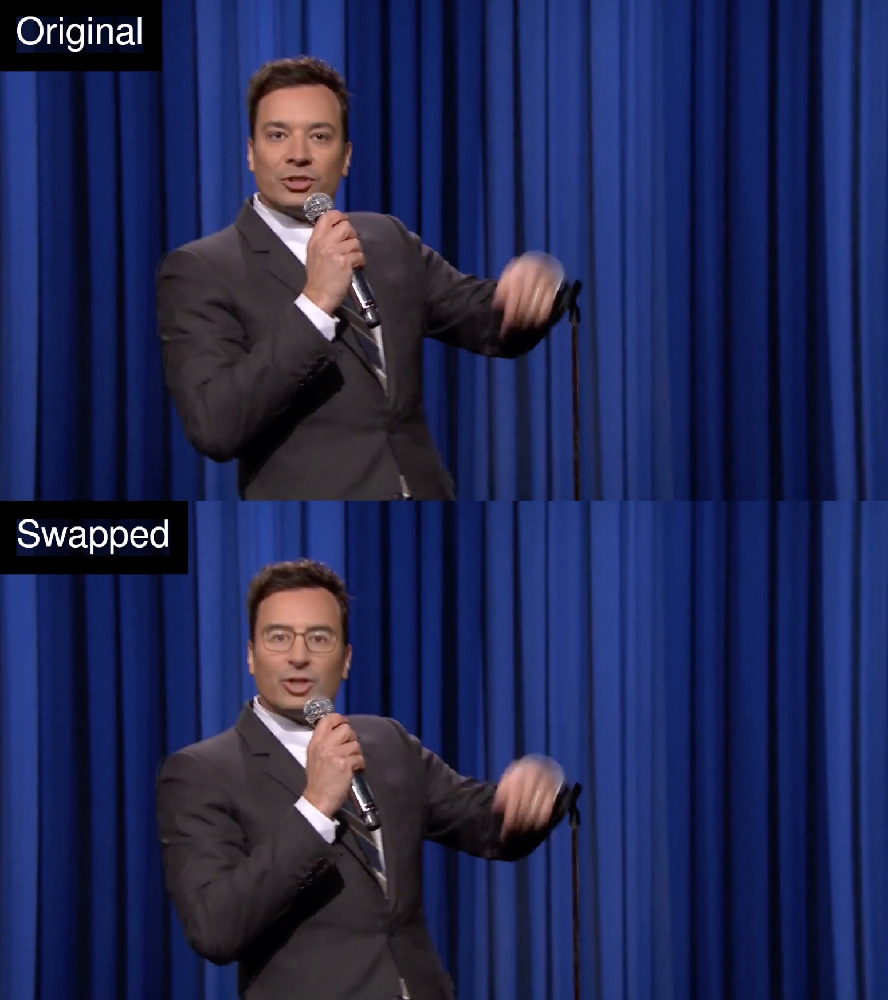

# FaceIt



A script to make it easy to swap faces in videos using the [deepfakes/faceswap](https://github.com/deepfakes/faceswap) library, and urls of YouTube videos for training data. The image above shows a face swap from Jimmy Fallon (host of The Tonight Show) to John Oliver (host of Last Week Tonight).

## Overview

I wrote this script to help me explore the capabilities and limitations of the video face swapping technology known as [Deepfakes](https://github.com/deepfakes/faceswap).

**[Read all about it in this detailed blog post.](https://goberoi.com/exploring-deepfakes-20c9947c22d9)**

What does this script do? It makes it trivially easy to acquire and preprocess training data from YouTube. This greatly simplifies the work required to setup a new model, since often all you need to do is find 3-4 videos of each person to get decent results.

## Installation

There is a requirements.txt file in the repo, but to make it all work, you'll need CUDA libraries installed, and ideally Dlib compiled with CUDA support.

## Usage

Setup your model and training data in code, e.g.:
```python
# Create the model with params: model name, person A name, person B name.
faceit = FaceIt('fallon_to_oliver', 'fallon', 'oliver')

# Add any number of videos for person A by specifying the YouTube url of the video.
faceit.add_video('fallon', 'fallon_emmastone.mp4', 'https://www.youtube.com/watch?v=bLBSoC_2IY8')
faceit.add_video('fallon', 'fallon_single.mp4', 'https://www.youtube.com/watch?v=xfFVuXN0FSI')
faceit.add_video('fallon', 'fallon_sesamestreet.mp4', 'https://www.youtube.com/watch?v=SHogg7pJI_M')

# Do the same for person B.
faceit.add_video('oliver', 'oliver_trumpcard.mp4', 'https://www.youtube.com/watch?v=JlxQ3IUWT0I')
faceit.add_video('oliver', 'oliver_taxreform.mp4', 'https://www.youtube.com/watch?v=g23w7WPSaU8')
faceit.add_video('oliver', 'oliver_zazu.mp4', 'https://www.youtube.com/watch?v=Y0IUPwXSQqg')
```

Then create the directory `./data/persons` and put one image containing the face of person A and another of person B. Use the same name that you did when setting up the model. This file is used to filter their face from any others in the videos you provide. E.g.:
```
./data/persons/fallon.jpg
./data/persons/oliver.jpg
```

Then, preprocess the data. This downloads the videos, breaks them into frames, and extracts the relevant faces, e.g.:
```
python faceit.py preprocess fallon_to_oliver
```

Then train the model, e.g.:
```
python faceit.py train fallon_to_oliver
```

Finally, convert any video that is stored on disk, e.g.:
```
python faceit.py convert fallon_to_oliver fallon_emmastone.mp4 --start 40 --duration 55 --side-by-side
```

Note that you can get useful usage information just by running: `python faceit.py -h`


## License

*This script is shared under the MIT license, but the library it depends on currently has no license. Beware!*

Copyright 2018 Gaurav Oberoi (goberoi@gmail.com)

Permission is hereby granted, free of charge, to any person obtaining a copy of this software and associated documentation files (the "Software"), to deal in the Software without restriction, including without limitation the rights to use, copy, modify, merge, publish, distribute, sublicense, and/or sell copies of the Software, and to permit persons to whom the Software is furnished to do so, subject to the following conditions:

The above copyright notice and this permission notice shall be included in all copies or substantial portions of the Software.

THE SOFTWARE IS PROVIDED "AS IS", WITHOUT WARRANTY OF ANY KIND, EXPRESS OR IMPLIED, INCLUDING BUT NOT LIMITED TO THE WARRANTIES OF MERCHANTABILITY, FITNESS FOR A PARTICULAR PURPOSE AND NONINFRINGEMENT. IN NO EVENT SHALL THE AUTHORS OR COPYRIGHT HOLDERS BE LIABLE FOR ANY CLAIM, DAMAGES OR OTHER LIABILITY, WHETHER IN AN ACTION OF CONTRACT, TORT OR OTHERWISE, ARISING FROM, OUT OF OR IN CONNECTION WITH THE SOFTWARE OR THE USE OR OTHER DEALINGS IN THE SOFTWARE.
